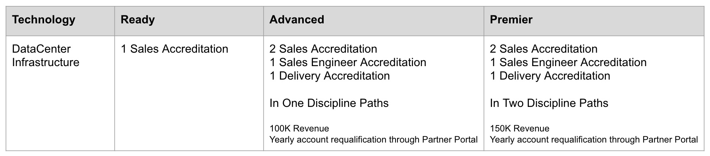

= Accreditation Status

Link to course catalog: link::https://www.redhat.com/en/partners/course_catalog

[.lead]
Example Advanced Partner with Automation Accreditation

Choose one of the following
*Option 1 - I.T. Optimization Track:* course names
2 SALES - Red Hat Sales Specialist - I.T. Optimization
1 SALES ENGINEER - Red Hat Sales Engineer Specialist - Platform
1 DELIVERY - Red Hat Delivery Specialist – Platform
                                   *OR*
*Option 2 - I.T. Automation + Management Track:* course names
2 SALES – Red Hat Sales Specialist - I.T. Automation & Management
1 SALES ENGINEER – Red Hat Sales Engineer Specialist - Automation
1 DELIVERY - Red Hat Delivery Specialist - Automation I

*For more details please reach out to Partner Account Manager*

