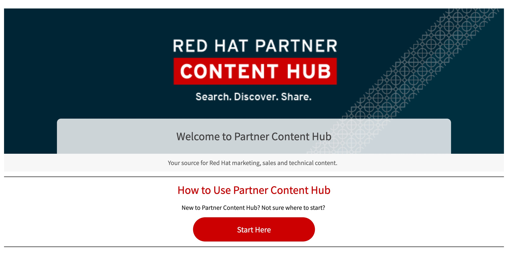
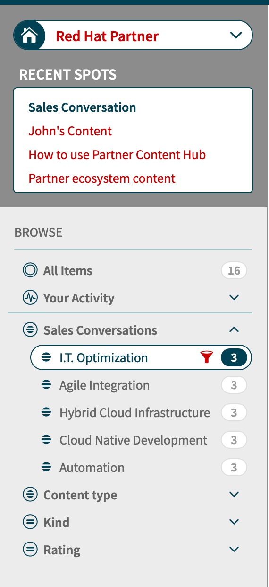
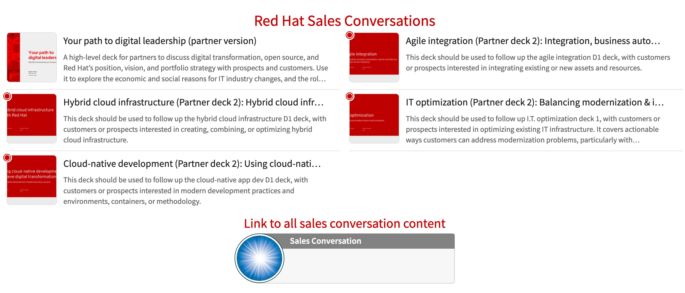
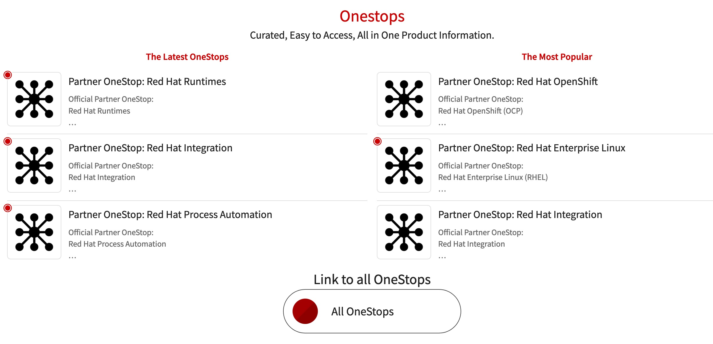
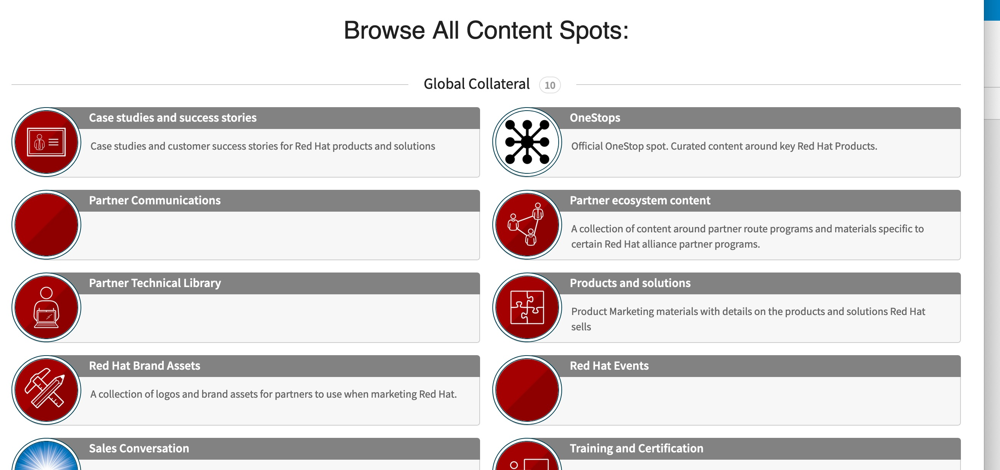
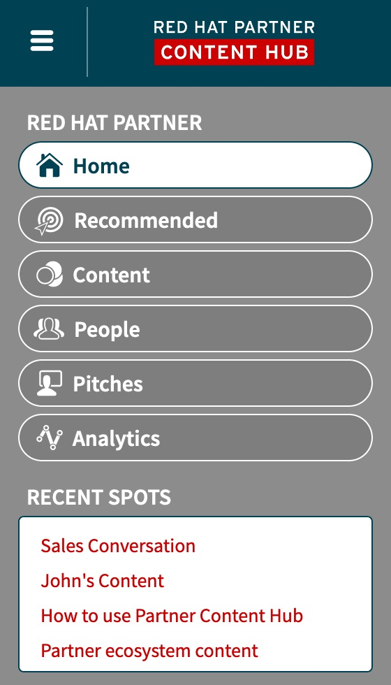
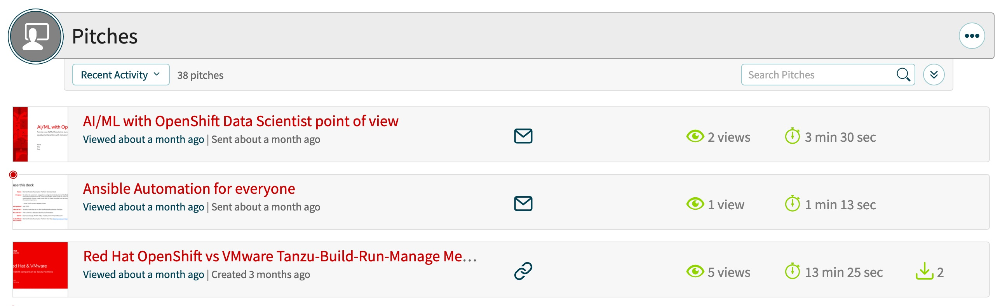
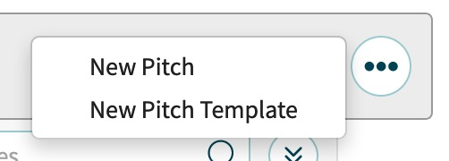
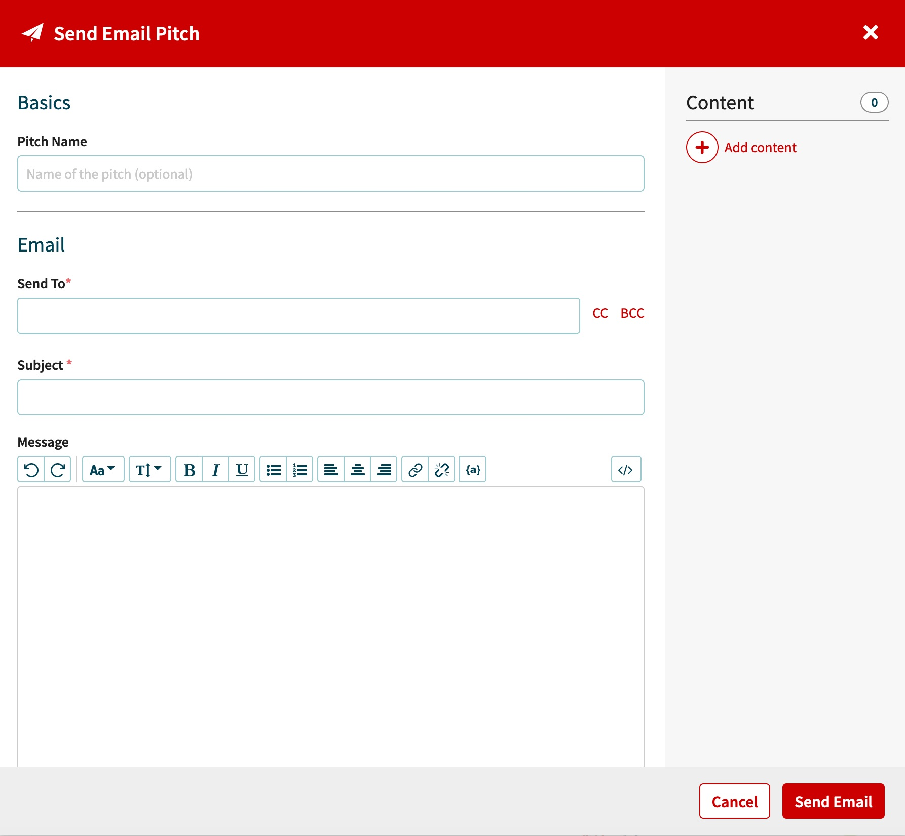
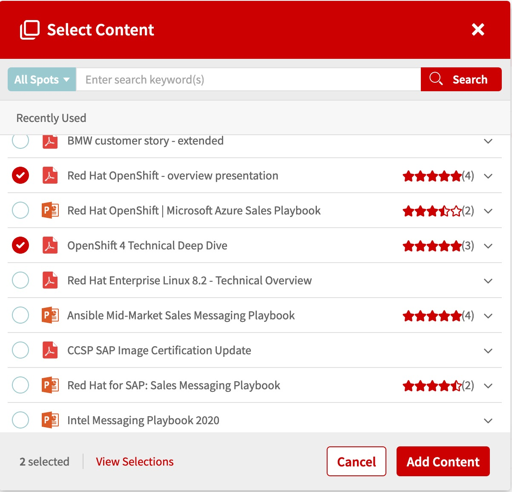

= Partner Content Hub

The *Partner Content Hub* is a document management system which is a huge repository for useful information. The content hub can be found at:

https://redhat-partner.highspot.com

It requires the user to log into the application.

The user is presented with the welcome screen with navigation on the left, the user profile in the upper right and the search bar for searching  content. It should be noted that content on how to use the site is on the main page with the *Start Here* button.

[.lead]
*Basic Usability Tips*

* The search field is almost always presented across the top of the screen and can be used at any time to quickly search for content. Additional filtering is also provided down the left hand side of the screen. 

* The menu changes based on the content spot selected. The menu allows you to select content by type of content within the selected Spot.

Scrolling down the home page, the next area of interest is the *Red Hat Sales Conversations*. The 5 top Red Hat sales conversations are presented at the top with a link at the bottom to access all content related to sales conversations.

 
At Red Hat, due to the comprehensive nature of our product portfolio we tend to organize our product information around sales conversations. 

Scrolling down the home page further you reach the *OneStop* section. 

These *OneStops* are pages that give a comprehensive view of the content that is available for a particular product. On these sites you will find content organized into five categories; Sales literature, Customer material, Technical material, Sales Training and Technical Training for each product. In addition, product announcements and links to related products. These are extremely helpful in finding content.

At the bottom of the page is where the *Content Spots* are located. 

The *Spots* provide yet another grouping for content. The *Content Spot* section is quite comprehensive covering Global, Regional collateral, Pricebooks and Marketing Campaigns.

The *Partner Content Hub Cheatsheet* covering many handy tips to mining the site for relevant content and it is located at the following address:  

link::https://redhat-partner.highspot.com/items/5972605272ad8e32c9d4f6d6

The *Pitch* functionality, located on the menu on the left, provides the ability to organize content and outreach to a customer. The way it works is when *Pitch* is selected the user is taken to a page with the available pitches. From there they can either create a new pitch, which is just bundled content presented to a customer, or leverage an existing pitch. The benefit with pitches is that it organizes content and tracks customer interaction with the content. That way you know if the customer actually looked at what was sent to them.

The *Pitch* screen has a listing of the pitches that have been created in reverse chronological order. (Newer pitches are on top). 

By selecting the three dots on the right of the screen another popup shows up that allows a new pitch to be created and by selecting new pitch a popup is presented to the user that allows them to bundle content and either email it, send a link or present the material realtime to the customer.  Details of the customer accessing the content are captured and kept for analysis. 

image::images/pitch-type-popup.jpg[]

If *Email Pitch* is selected, content can then be added to the email using the plus sign on the right. 

Once added the user can see the first page of what is being emailed. Similar flows exist for the *Link Pitch* as well as the *Live Pitch*.

