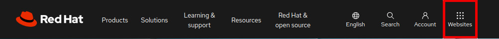
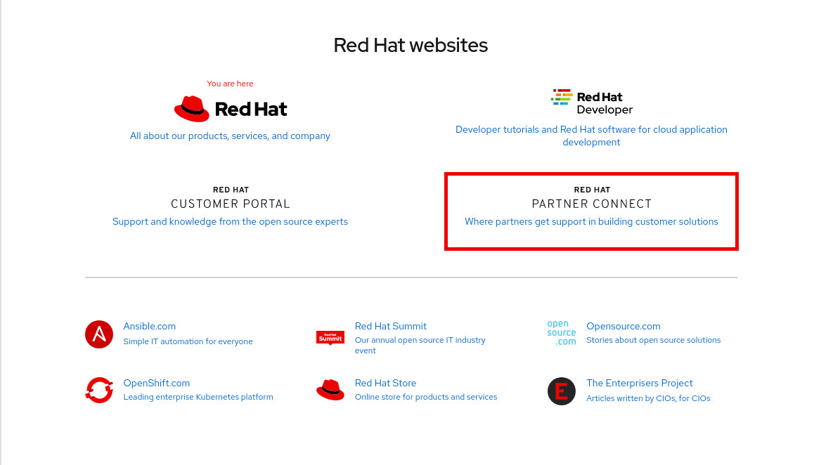
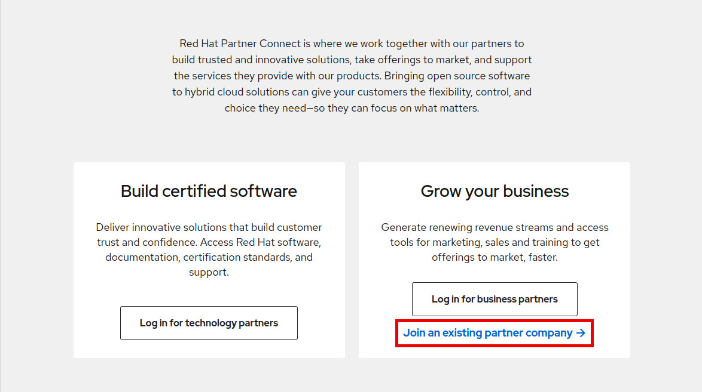
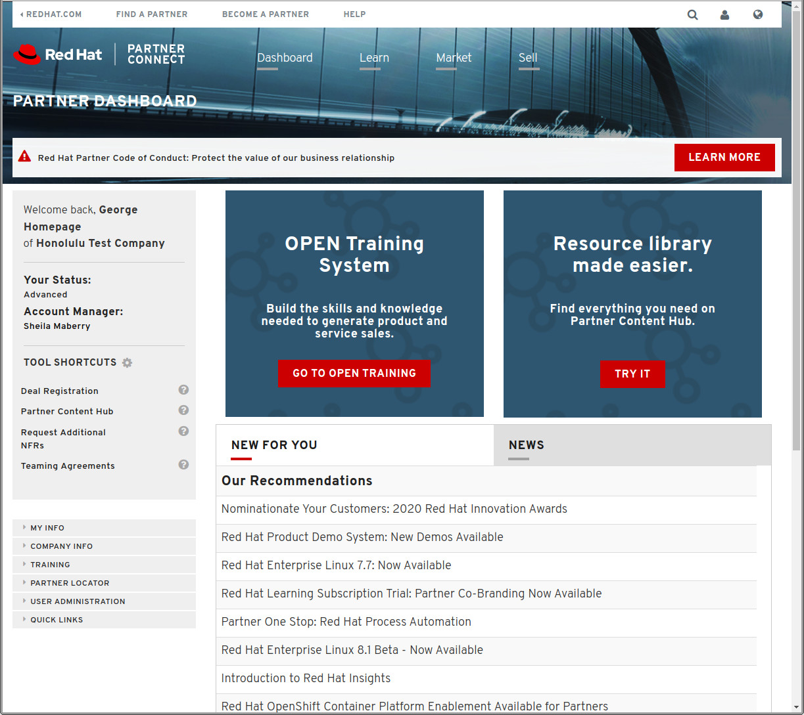
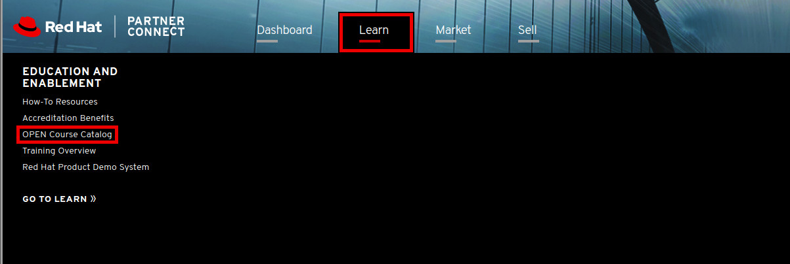
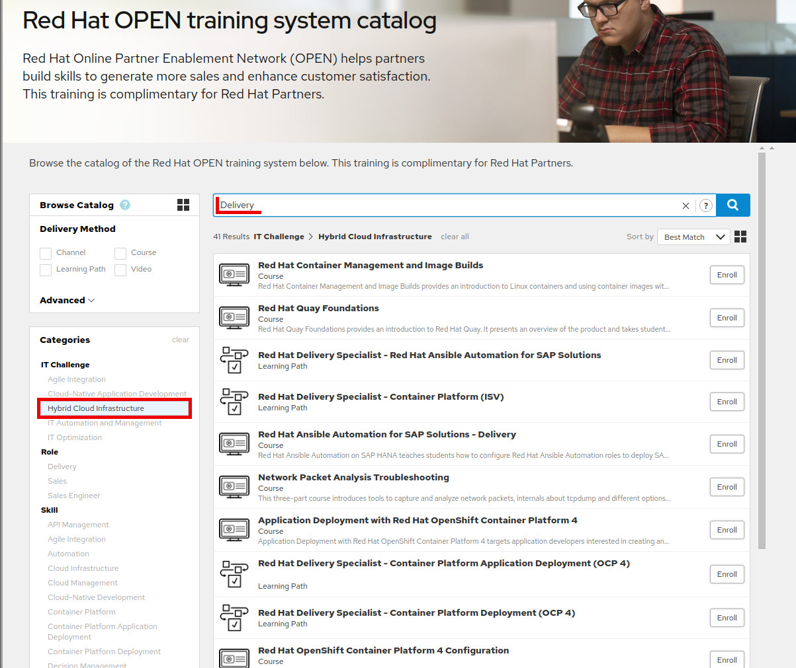

= Red Hat Partner Connect

*Red Hat Partner Connect* is a partner community where we work together to build ideal customer solutions and support the services you provide with our products.

As a Partner this is where you can become part of our campaigns to cut through the noise of today's marketing environments. We'll help you differentiate your brand as an open source partner and provide training every step of the way.

[.lead]
To access Partner Training goto link:https://www.redhat.com/en[https://www.redhat.com/en^] and click on the "Websites" link (see image below).

[%hardbreaks]

[.lead]
Next click on the *PARTNER CONNECT* button.

[.lead]
Your first step is to connect your partner login with your organization.  First, click on  *Log in*.

[.lead]
Click on *JOIN AN EXISTING PARTNER COMPANY*.  This will take you through a series of web pages whose goal is to *connect* your *Partner Login* to your organization.

The registration process will connect your login id with your company partner information.  The completion of this step will initiate a process where an email is sent to your address.  In the email will be a link that is used to complete the process.  Clicking on the link will finish your connection to the partner portal and will take you to the Partner Dashboard.  The dashboard should look like the following:

[.lead]
After successful login, click on the *Learn* tab and then click on *OPEN Course Catalog*

[.lead]
The Red Hat OPEN training system catalog will be displayed, providing access to all OPEN training that is available for Red Hat Partners. Training can be listed by specific IT Challenge categories, by Skill track, as well as by Role: *Delivery*, *Sales* and *Sales Engineer*.  For example, if you'd like to see all *Delivery* training available for *Hybrid Cloud Infrastructure*, on the left under *Categories -- IT Challenge* , click on *Hybrid Cloud Infrastructure* and then in the filter box, type in *Delivery*.

[.lead]
To quickly find and enroll in the *Sales Engineer* Learning Path, on the left under *Delivery Method*, click the box next to *Learning Path*, on the left under *Categories -- Skill*, click on *Automation* and then in the filter box, type in *Sales Engineer*. Once the results are displayed, click on enroll for the *Sales Engineer* Learning Path item.

image::images/automation_learning_path.jpg
