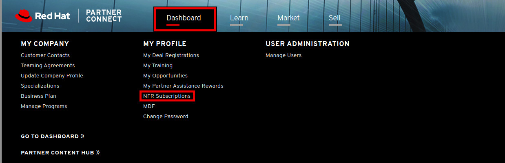

= Red Hat Partner Subscription Review

_This section has information regarding subscriptions for the Partner._ 

= Overall Process
### 1) Have redhat.com account  (required for Partner Connect access)

### 2) Submit a link:https://github.com/redhat-partner-tech/advanced-partner-enablement/blob/master/pages/not_for_resale.adoc[Not For Resale] request

In order to access and manage all of your NFR subscription needs, login to the link:https://partnercenter.redhat.com/Dashboard_page[Red Hat Partner Connect Dashboard^].  

[.lead]
Next click on the *Dashboard* tab and then click *NFR Subscriptions*.

[.lead]
Scroll down to the *How to request an NFR subscription* section for a general overview of the process.

### 3) Once approved, software shows up for download link:https://access.redhat.com/management[HERE]

NOTE: **YOU CANNOT USE PERSONAL ACCOUNTS FOR A PARTNER SUBSCRIPTION. YOU MUST USE A CORPORATE ACCOUNT.**

- If checking a existing partner user/redhat.com -- look in Supportable to ensure they have a Corporate Account.
// what is this trying to say??? "partner user/redhat.com

- For a given account (customer or partner) there can be multiple contracts, account admins, etc. -- check Supportable.

