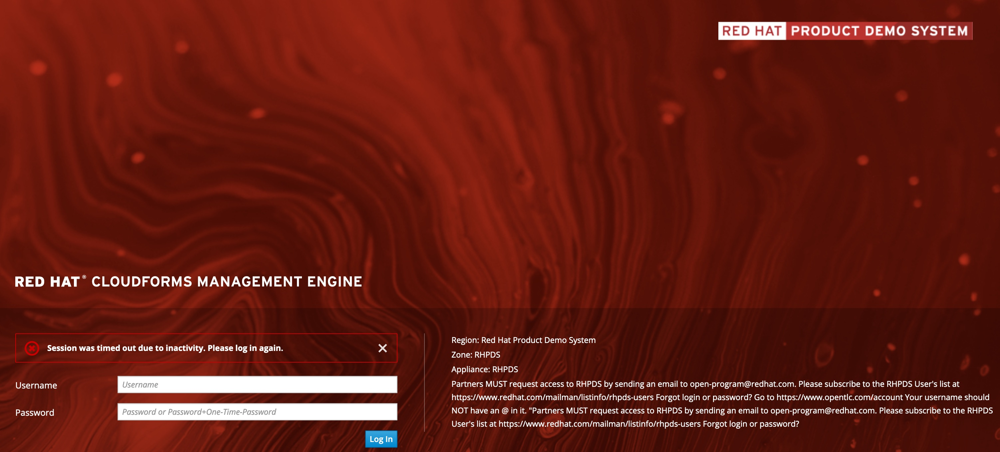
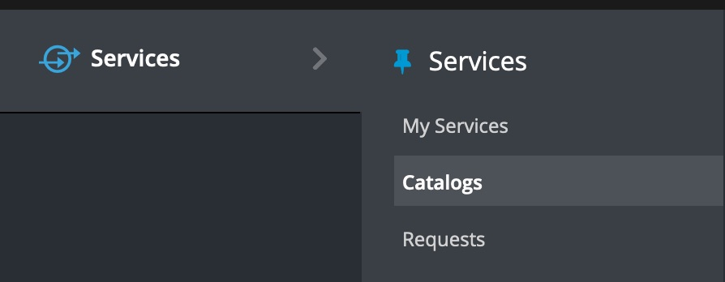
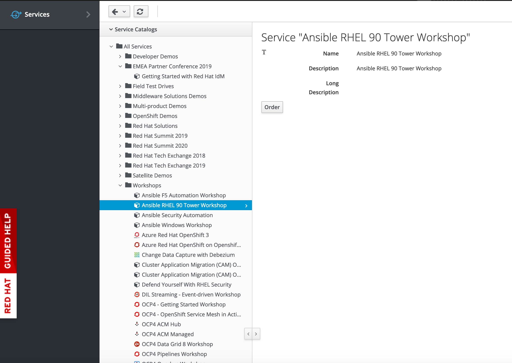
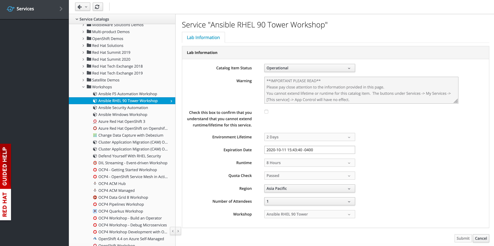
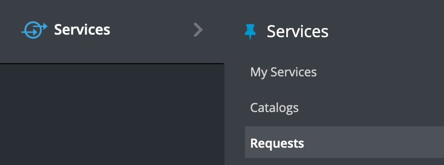
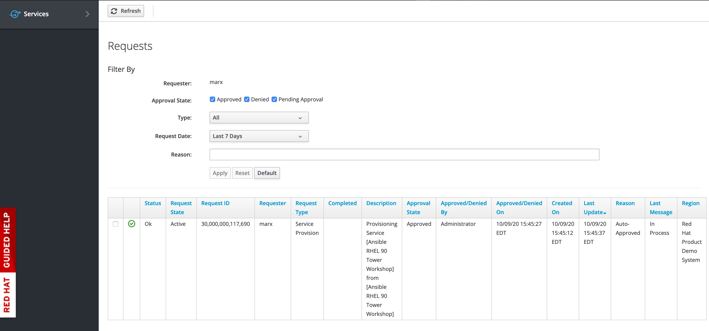
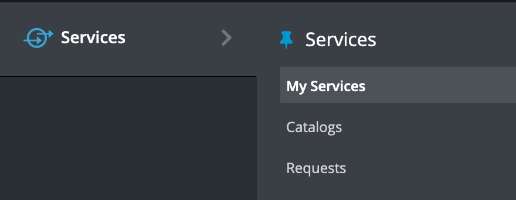
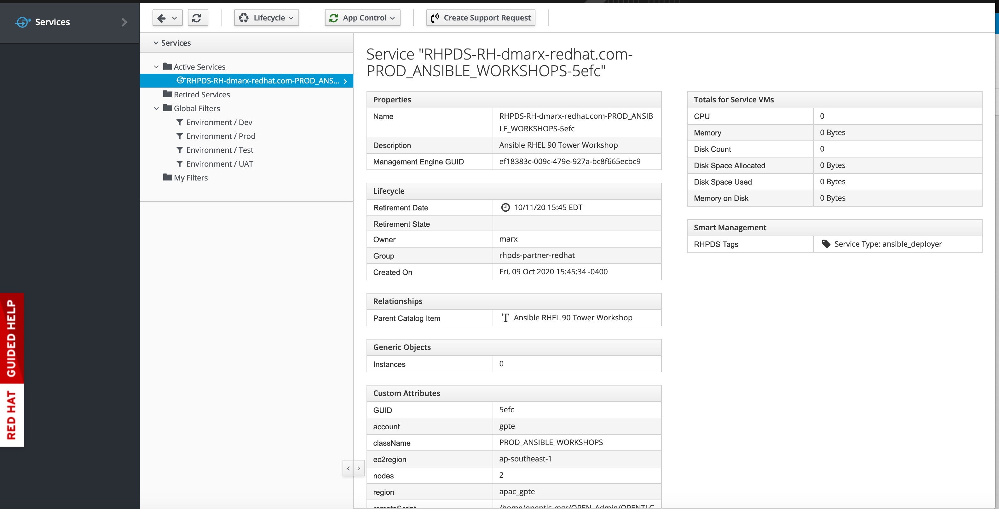

= Using Red Hat Product Demo System (RHPDS)

One of the benefits to being an Advanced or Premier Red Hat partner is access to the Red Hat Product Demo System (RHPDS). RHPDS provides environments that can be spun up “on the fly” to support workshops, demos or even informal training.

RHPDS uses Amazon Cloud services behind the scene and there is a cost to Red Hat for its use. This cost is NOT passed along to the partner.  

To obtain access partners must request it by emailing open-program@redhat.com.

These lab environments are temporary, lasting 48 hours, however they can be extended for up to 1 week. Some of the environments are stopped after 8 hours running and must be restarted after that time. These environments at the end of their life (typically 48hrs) are automatically deleted.

When you log on you are presented with a single menu option “Services” with three subheadings:

* *My Services* - Services that I have ordered and are currently running
* *Catalog* - The Catalog of available services that I can order
* *Requests* - Requests are currently underway. 

The Catalog option brings up a list of environments that you can order. There are limits to how many that can be order at any given time and the number of users supported by each environment. The same service cannot be active twice and there is a three active services limit that one can order at any given time.

Once an item is ordered, fill out the form and click the Submit button to request the environment. You will be taken to the Request screen automatically and will receive emails on the progress. The last email will contain helpful links and information to access your environment.

*Note:* on most of the workshop order forms you will need to provide either a SFDC Opportunity, Campaign ID, or Partner Registration number.

The request then shows up in the request queue. Most Ansible workshop environment takes roughly 45 minutes to provision whereas an OpenShift workshop is provisioned in about 70 minutes. During provisioning records will be in the request queue showing they are being processed.

Finally the the service will show up in the My-Services menu.

Provision service is below. This view contains a lot of handy information that will allow you to interact with the workshop environment. In addition the final email you will receive will have most if not all of the other information you will need to know to complete the workshop.

